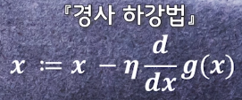

_**머신러닝을 적용시키는 방법은 쉽게는 함수을 만드는 것이다.**_

* 머신러닝의 핵심
  * 과거의 관측을 기반으로 새로운 샘플의 결과값을 예측
  
* 우리가 바라는 이상
  * 적합한 가중치와 절편 탐색
  * => 실제 결과값과 예측 결과값의 차이를 찾아 0을 만드는  
  
* 우리의 목표
  * 모든 점에서 생기는 오차의 합계가 가능한 작아지는 함수를 찾는것
  * 적용되는 식을 만드는 것 => **목적함수**
  
### 목적함수
  각각의 학습 데이터마다, 실제 결과값과 예측한 결과값의 오차를 
  제곱해서 그것을 모두 더하고, 또 그것에 1/2을 곱해준다.
  **1/2은 미분과 관련이 있다.**
* 
### 최적화 문제
  이 목적 함숫값이 가장 작아지는 파라미터들을 찾는 것
  
* 경사 하강법
  * 가중치와 절편을 탐색하는 기법
  * 목적함수의 값을 최소화 시키기 위해 마치 경사를 내려가는 듯 최소값을 찾는 기법
  * **미분**
    * 간격을 좁혀서 기울기를 구하는것
    * 
    * 성질
    * 미분후 나온 함수 **도함수**
    * 도함수의 부호 반대 방향으로 밀면 자연스럽게 최소값 쪽으로 움직인다.
  * 
  * A:=B A를 B에 따라 정의한다.
  * η
    * 학습률
    * 양의 정수 사용
    * 학습률에 따라 최소값에 도달하기까지 갱신(수렴)하는 속도가 달라진다.
    * 값이 작을수록 정확하지만 시간이 오래걸린다.
    * η = 1 **발산** 현상 관측
    * η = 0.1 **수렴** 속도 지연
    
